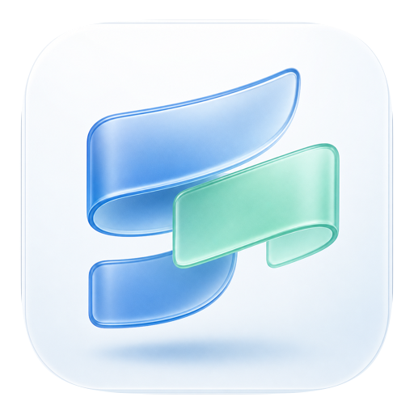
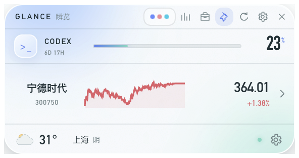
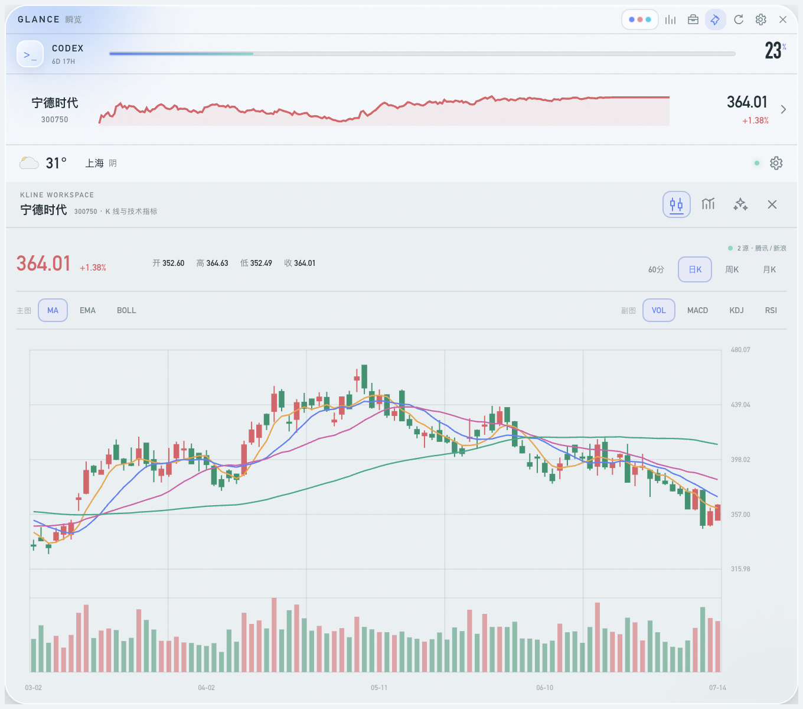
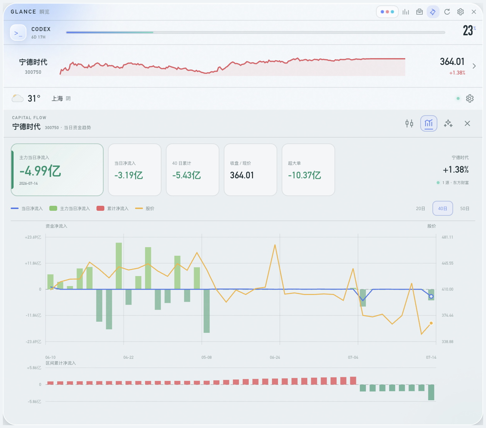
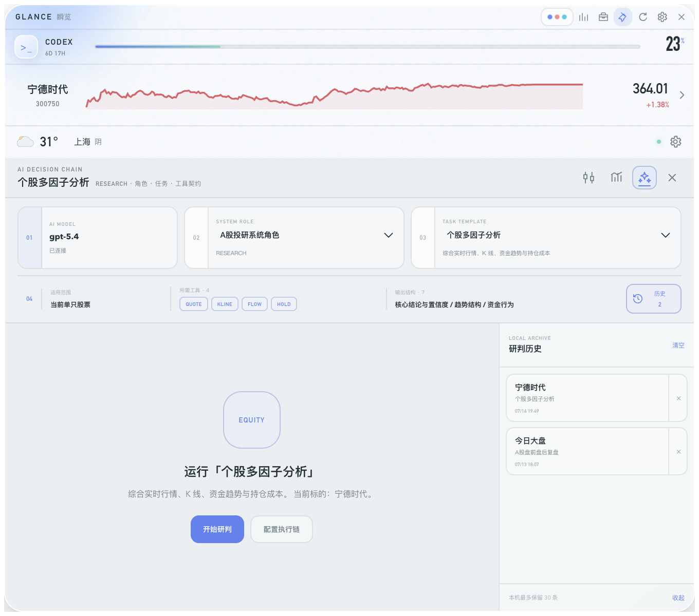
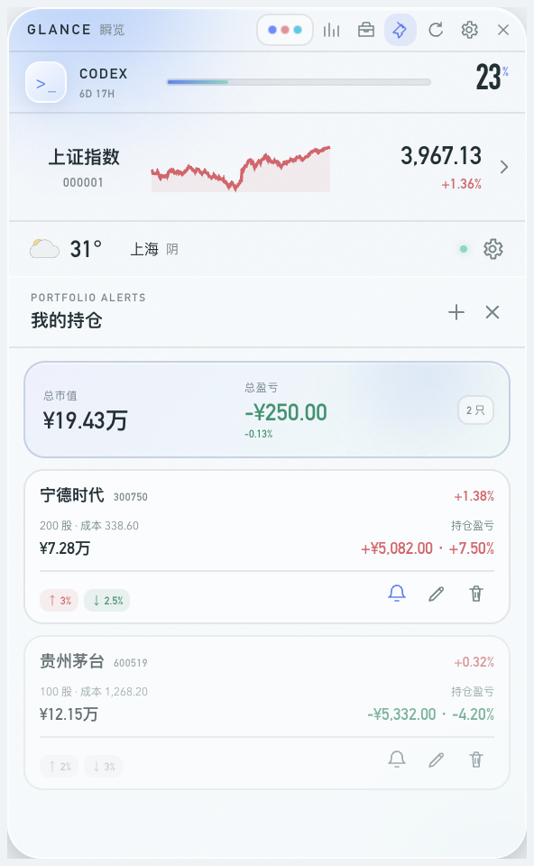
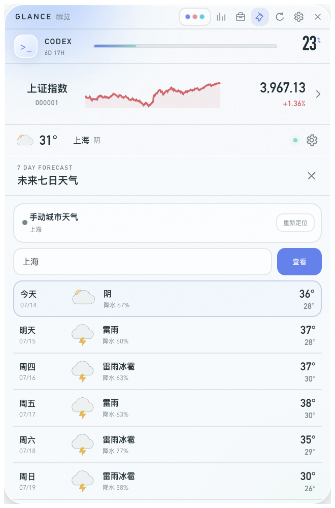
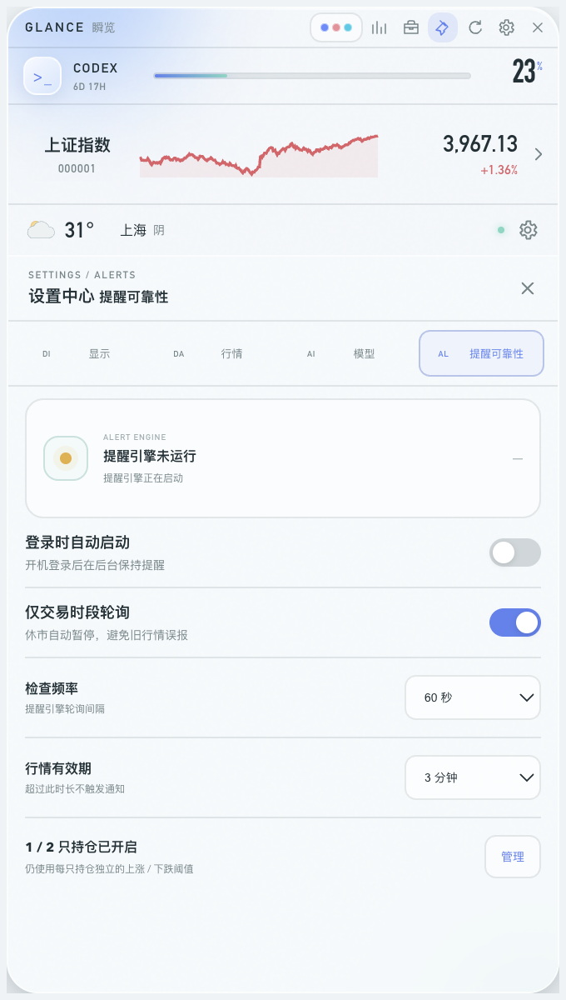

<p align="center">
  
</p>

<h1 align="center">瞬览 GlanceDeck</h1>

<p align="center">
  把 Codex 用量、A 股行情、持仓提醒、天气与 AI 研判收进桌面角落。
</p>

<p align="center">
  <code>296 × 156px 紧凑悬浮窗</code> · <code>macOS / Windows</code> · <code>多源实时行情</code> · <code>本地优先</code>
</p>

<p align="center">
  <a href="https://github.com/kingdom8831-beep/glancedeck/releases/latest"><b>下载最新版本</b></a>
  ·
  <a href="https://github.com/kingdom8831-beep/glancedeck/releases">查看全部 Releases</a>
</p>

<p align="center">
  
</p>

## 一眼看懂

| 行情研判 | AI 执行链 | 桌面效率 |
| --- | --- | --- |
| 多源报价、K 线指标、资金流入流出与主力净流入 | 模型 → 系统角色 → 任务模板 → 工具和输出契约 | 菜单栏常驻、置顶悬浮、快捷唤回与三套主题 |
| 持仓成本、盈亏贡献、上涨/下跌阈值提醒 | 内置大盘、个股、资金和持仓研判模板，历史保存在本机 | 定位天气、七日预报、Codex 剩余额度一屏掌握 |

## 产品预览

### K 线与技术指标

<p align="center">
  
</p>

<table>
  <tr>
    <td width="50%"></td>
    <td width="50%"></td>
  </tr>
  <tr>
    <td align="center"><b>资金趋势</b><br>主力、当日、累计净流入与股价同图对照</td>
    <td align="center"><b>AI 研判执行链</b><br>角色、任务、工具契约与本机研判历史</td>
  </tr>
</table>

<table>
  <tr>
    <td width="33%"></td>
    <td width="33%"></td>
    <td width="33%"></td>
  </tr>
  <tr>
    <td align="center"><b>持仓与阈值提醒</b></td>
    <td align="center"><b>定位与七日天气</b></td>
    <td align="center"><b>提醒可靠性控制</b></td>
  </tr>
</table>

## 下载与安装

前往 [GitHub Releases](https://github.com/kingdom8831-beep/glancedeck/releases/latest) 下载：

- `GlanceDeck-Setup-*-x64.exe`：Windows 10/11 x64 安装版
- `GlanceDeck-Portable-*-x64.exe`：Windows 10/11 x64 免安装版
- `GlanceDeck-*-arm64.dmg`：Apple Silicon Mac 推荐安装包
- `GlanceDeck-*-arm64.zip`：免镜像备用包

Windows 可直接运行安装版或免安装版；打开 DMG 后将“瞬览 GlanceDeck”拖入“应用程序”。当前公开版本尚未进行商业代码签名；Windows SmartScreen 或 macOS Gatekeeper 首次提示时，需要选择继续运行或在 Finder 中右键应用并选择“打开”。

## 功能

- 通过本机 `codex app-server` 读取真实短时/每周用量和重置时间
- 切换 Codex 账号后会检测认证状态变化并自动重连；点击刷新时也会强制重新读取当前账号额度
- 腾讯、东方财富、新浪三路实时行情并行校验，自动剔除明显偏离值并在单源故障时降级
- 常驻态只显示一只股票，点击行情区域再展开切换
- 支持最多 6 只 A 股自选，设置会保存在本机
- 持仓管理：记录股数、成本价，汇总市值与持仓盈亏
- 每只持仓可分别设置上涨/下跌百分比阈值；窗口隐藏后仍会持续轮询并发送系统通知
- 天气优先跟随系统定位，定位失败后可切换手动城市
- 点击天气图标查看未来 7 日天气、最高/最低温和降水概率
- 点击迷你走势展开 K 线工作区，支持 60 分钟、日、周、月周期
- 内置 MA、EMA、BOLL、VOL、MACD、KDJ、RSI 指标并可直接切换叠加
- 图表标题栏可一键切换到资金趋势，组合展示每日净流入、主力净流入柱、区间累计净流入与股价右轴，并支持 20/40/50 日切换
- AI 研判采用四层执行链：模型配置 → 研判系统角色 → 研判任务模板 → 工具、输出结构与适用范围
- 内置 A 股投研、资金行为、持仓风控三类系统角色，以及大盘复盘、个股多因子、自选扫描、持仓复盘、资金趋势和风险纪律等任务模板
- 每个任务只调用模板声明的行情、K 线、资金流或持仓工具，并按固定章节生成结构化报告
- 研判结果自动保存在本机历史中，最多保留 30 条；可恢复当时的任务与标的、单条删除、全部清空，并复制为 Markdown
- AI 接口地址、模型、API Key 与提示词在设置中管理；支持 OpenAI、DeepSeek、Ollama 等 Chat Completions 兼容接口
- 新增“测试并获取模型”：先验证接口与 API Key，再读取 `/models` 可用模型列表并以下拉框选择；新 Key 未验证时不会保存
- 设置中的研判文字作为用户“附加要求”，内置角色、任务范围、工具契约和输出结构不会被覆盖
- macOS 上使用 Electron `safeStorage` 加密保存 AI API Key，页面层不会读取到明文
- 磨砂玻璃、治愈可爱、极客科技三套可切换主题
- 设置页按“显示、行情、模型、提醒可靠性”四个区域组织，避免模型配置与日常选项混在一起
- 提醒引擎支持开机启动、仅交易时段检查、30/60/120 秒轮询和 2/3/5/10 分钟行情新鲜度阈值，并显示最近检查与异常状态
- 始终置顶、所有桌面可见、透明度调节
- macOS 菜单栏与 Windows 系统托盘常驻入口；点击可显示/隐藏悬浮窗、立即刷新或退出
- `⌘ ⇧ U` 显示/隐藏快捷键

菜单栏入口由原生 AppKit 助手绘制，并与 Electron 主进程在本机通信；关闭悬浮窗不会退出应用，可从菜单栏随时唤回。

## 运行

```bash
npm install
npm run dev
```

生产模式：

```bash
npm start
```

打包 macOS 应用：

```bash
npm run package:mac
```

生成用于 GitHub Release 的 DMG 与 ZIP：

```bash
npm run release:mac
```

生成 Windows x64 安装版与免安装版：

```bash
npm run release:win
```

重新生成 README 产品截图：

```bash
npm run screenshots:readme
```

截图任务使用独立演示配置，不会读取或写入日常使用的 API Key、持仓、定位和窗口设置。

产物位于 `release/mac-arm64/瞬览 GlanceDeck.app`（Apple Silicon）或对应架构目录。

## 数据

- Codex：本机 Codex CLI 的 app-server，不读取或上传登录凭据
- 实时报价：腾讯证券、东方财富、新浪财经；按时间与价格一致性选择当前值
- K 线：腾讯证券为主、新浪财经为备用
- 资金趋势：东方财富日级历史资金流与盘中分钟资金流
- 天气：Open-Meteo Forecast / Geocoding API

行情仅用于桌面信息展示。网络不可用时，应用会保留已加载内容；首次启动无缓存时仅显示占位数据。

涨跌幅提醒依据行情接口返回的“当日涨跌幅”，不是持仓盈亏比例。同一阈值只提醒一次；行情离开提醒线后再次穿越才会重新提醒。默认仅在 A 股工作日交易窗口内检查，并拒绝使用超过设置时限的陈旧报价。
